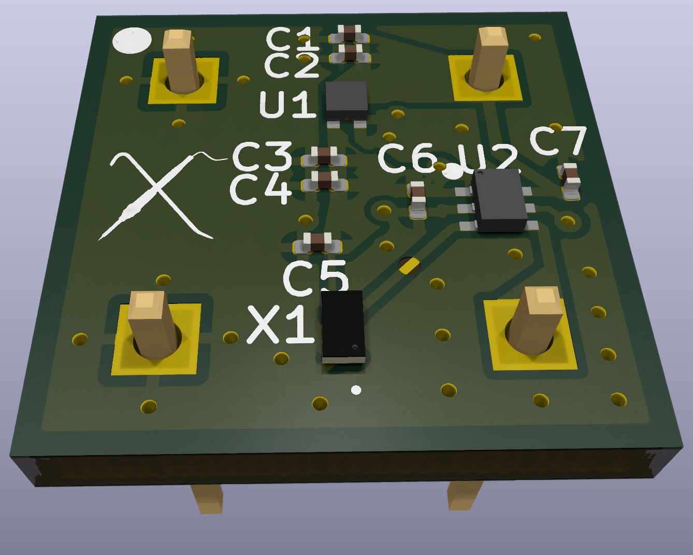

# Takahashi Sky Patrol II Repair and Custom Oscillator
This repository contains some repair and troubleshooting files for the Takahashi Sky Patrol II Power Board and Remote.

It also includes a design for a drop-in replacement MEMS oscillator board in case the crystal oscillator is damaged. This design has been tested and worked on a previous repair, but no warranty is expressed or implied for any of the designs or schematics contained in this repository. Use at your own discretion!

## Repair Resources

Below are several resources that you may find useful when repairing or troubleshooting a Takahashi Sky Patrol 2.

### Remote Board Schematic 
 
You can view the schematic for the Takahashi Sky Patrol II Remote Board here:
 
[📄 Takahashi Sky Patrol 2 Remote Board Schematic (PDF)](schematics/Takahashi%20Sky%20Patrol%202%20Remote%20Board%20Schematic%20Rev%20B.pdf)

### Power Board Schematic

You can view the schematic for the Takahashi Sky Patrol II Power Board here:

[📄 Takahashi Sky Patrol 2 Power Board Schematic (PDF)](schematics/Takahashi%20Sky%20Patrol%202%20Power%20Board%20Schematic%20Rev%20A.pdf)

## Custom Oscillator Board

    

One component that can go bad on the Takahashi SP2 is the crystal oscillator. Do to the oscillator being a custom frequency, there is no drop-in replacement available. To solve this issue, I designed the following PCB that allows using a factory programmed MEMS oscillator in its place. Once the PCB is assembled, it is a simple drop-in replacement. 

The design contains some power and level translation in addition to the oscillator due to the original chip operating on 5V. For more information on the repair process and decisions, check out the accompanying video of the repair process. 

You can view the schematic for the custom oscillator board here:

[📄 Custom Oscillator Board Schematic (PDF)](schematics/Oscillator%20Board%20Rev%20A.pdf)

The files for the custom board are available [here](oscillator-board).

You can download the Gerber files for the custom oscillator board here:

[📦 Oscillator Board Rev A Gerber Files (ZIP)](oscillator-board/Oscillator%20Board%20Rev%20A%20Gerber.zip)

## Custom Oscillator Board Design and Build Video

